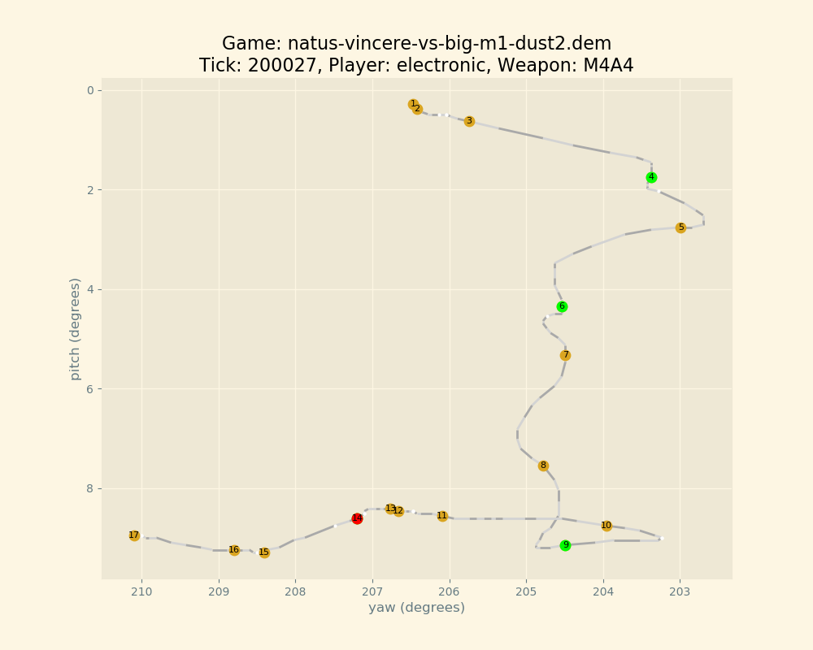

# csgo_spray_pattern_plotter

A tool to extract and plot spray patterns from CS:GO replays



# Prerequisites

* Python3
* Golang

# Example usage

## Spray data extraction

Extract data from a replay file and store it as comma separated values

```
go get -u github.com/markus-wa/demoinfocs-golang
go run spraypatternextractor.go -demo=natus-vincere-vs-big-m1-dust2.dem > natus-vincere-vs-big-m1-dust2.csv
```

## Spray pattern plotting

Use the comma separated values to create plots using python

```
python spraypatternplotter.py --csv natus-vincere-vs-big-m1-dust2.csv
```

# Contact

https://steamcommunity.com/id/dlxDaniel/

(or find my email)
